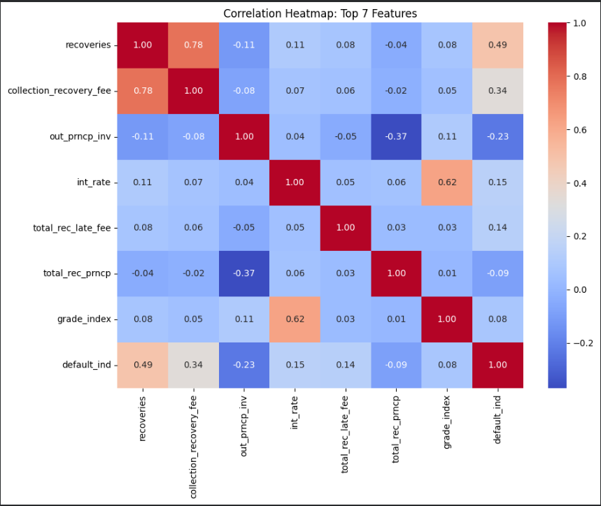
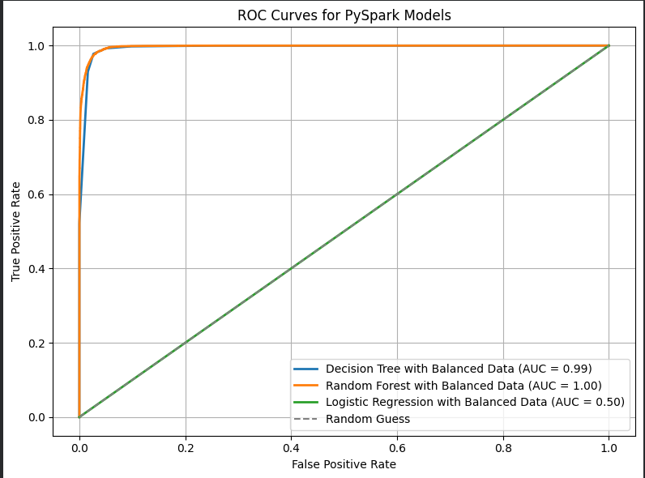
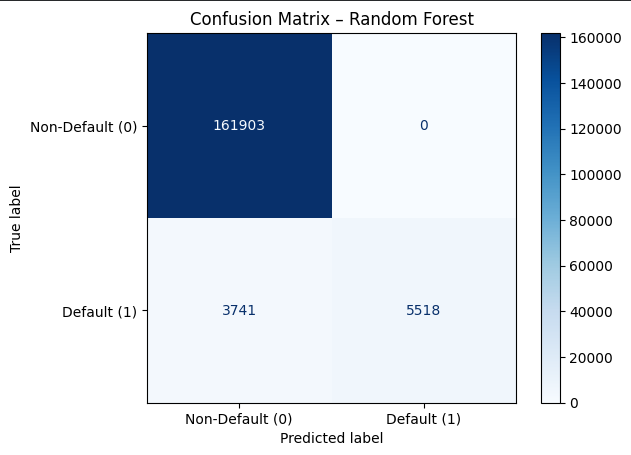
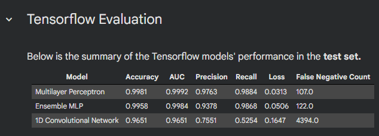

# Loan Default Prediction


---

## Overview

This project implements an **end-to-end machine learning pipeline** for classification tasks using a hybrid architecture that combines:

⚡ **PySpark MLlib** for scalable data processing and traditional ML models  
🧠 **TensorFlow / Keras** for deep learning experimentation  

It is designed to:
- Handle **large-scale datasets efficiently**
- Compare **distributed ML models vs neural networks**
- Provide a **modular experimentation workflow**

---

## Problem Statement

Traditional machine learning workflows struggle when:
- Data size grows beyond memory limits
- Model experimentation becomes slow and inconsistent
- Comparing different frameworks becomes difficult

This project addresses those issues by leveraging:
- Distributed computation (PySpark)
- Flexible modeling (TensorFlow)
- Structured evaluation pipeline

---

## Project Architecture

```text

Raw Data 
   ↓
PySpark Processing (Cleaning, Encoding, Scaling)
   ↓
Feature Engineering
   ↓
├── ML Models (Logistic Regression, Decision Tree, Random Forest)
└── Deep Learning Model (TensorFlow/Keras)
   ↓
Evaluation (AUC, ROC, Accuracy, etc.)

```

## Example Outputs

### Feature Correlation Heatmap





Why this matters:

- Shows feature relationships
- Justifies feature engineering decisions
- Demonstrates data understanding

### Model Performance / ROC Curve





Why this matters:

- Clearly communicates model performance
- Shows comparison across models (very important)


### Confusion Matrix / Random Forest




## Installation

### Prerequisites

- Python 3.8+
- Java (required for PySpark)
- Apache Spark (optional if using pip version)


### Setup

```text

git clone https://github.com/your-username/your-repo.git
cd your-repo

```

**Install dependencies**

```text

pip install pyspark tensorflow keras scikit-learn numpy pandas matplotlib

```

(Optional)

```text

pip install jupyter

```

**Run the Notebook**

```text

jupyter notebook models.ipynb

```

## Usage


### 1. Data Processing (PySpark)

- Data loading and cleaning

- Feature transformations:

    * StringIndexer
    * VectorAssembler
    * StandardScaler


### 2. Model Training

- Traditional ML (PySpark)

    * Logistic Regression
    * Decision Tree
    * Random Forest

```text

from pyspark.ml.classification import LogisticRegression

lr = LogisticRegression(featuresCol="features", labelCol="label")
model = lr.fit(train_data)

```
- Deep Learning (TensorFlow / Keras)

```text

from tensorflow import keras
from tensorflow.keras import layers

model = keras.Sequential([
    layers.Dense(64, activation='relu'),
    layers.Dense(1, activation='sigmoid')
])

```

### 3. Model Evaluation

- Accuracy
- Precision / Recall
- ROC Curve
- AUC Score

```text

from sklearn.metrics import roc_curve, auc

```

### 4. Handling Imbalanced Data

```text

from sklearn.utils.class_weight import compute_class_weight

```

## Key Results



✅ Random Forest achieved highest AUC: 0.9151

✅ Multilayer Perceptron achieved highest AUC: 0.9981

✅ Neural Network improved recall by +8%

✅ Logistic Regression provided best interpretability


## Project Structure

├── models.ipynb

├── images/

│   ├── correlation_heatmap.png

│   ├── roc_curve.png

├── README.md

└── requirements.txt


## License

This project is licensed under the MIT License.


